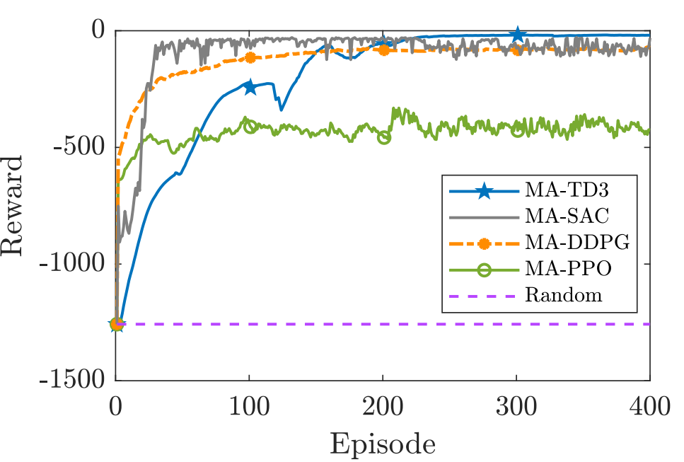
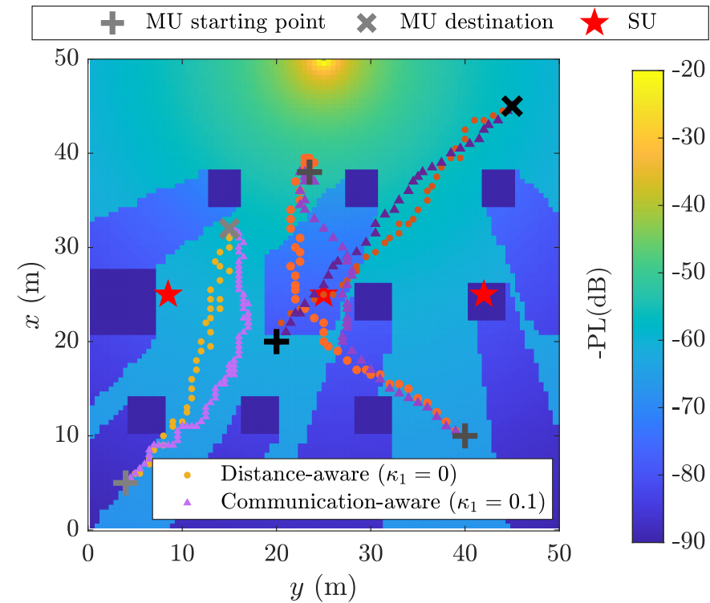

# MAAC_DRL
This repository contains the Python implementation of our submitted paper titled "Deep Reinforcement Learning for Joint Trajectory and Communication Design in Internet of Robotic Things" .
## Quick Links
[[Installation]](#installation)  [[Environment]](#environment) [[Usage]](#usage) 
## Introduction
We learn the multi-agent actor-critic deep reinforcement learning (MAAC-DRL) algorithms to reduce the decoding error rate and arriving time of robots in industrial Internet of Robotic Things with the requirements of ultra-reliable and low-latency communications.

Here are the setting of our simulations.

| Notation     | Simulation Value   | Physical Meaning                                             |
| ------------ | ------------------ | ------------------------------------------------------------ |
| $K$      | $\{2, 4, 6\}$                | the number of users    |
| $L$ | $\{2, 3\}$     | the number of antennas    |
| $K_{\rm MU}$ | $\{1, 2, 3\}$     | the number of robots     |
| $D$        | $100 \ {\rm bits}$      | packet size    |
| $M$        | $50 \ {\rm symbols}$     | the number of transmitted symbols    |
| $T_{\max}$   | $2000 \ {\rm s}$ | the moving deadline of robots   |
| $H_0$  | $1 \ {\rm m}$   | the height of antennas     |
| $P_{\max}$  | $[0.02, 0.1] \ {\rm W}$   | the maximal transmit power |
| $\sigma^2$     | $-100 \ {\rm dBm/Hz}$   | the variance of the additive white Gaussian noise                  |
| $v$          | $5 \ {\rm m/s}$    | the moving speed    |

## Results
<table style="padding: 0; border-spacing: 0;">
<tr style="padding: 0; border-spacing: 0;">
<td style="padding: 0; border-spacing: 0; width: 50%"></td>
<td style="padding: 0; border-spacing: 0; width: 50%"></td>
</tr>
</table>
